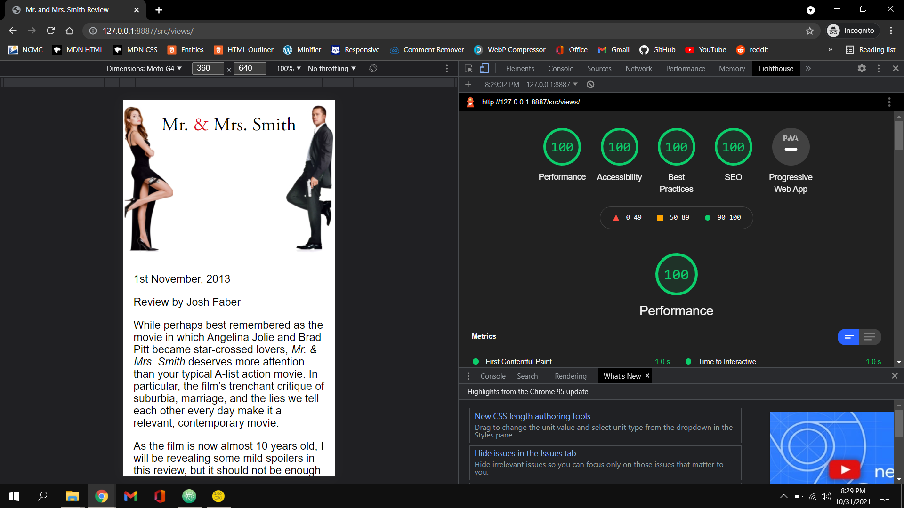
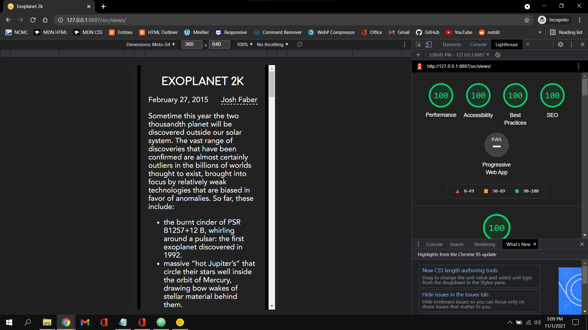

Very happy with how both of these websites turned out. I got them done in about 5 hours a piece so I'm getting much faster at making them. I had to read up on markdown syntax for a04b and learn all of that which took an hour or two but then you uploaded the markdown for the page so I didn't have to actually do that. I chose to anyway just to see how it is to use markdown and I included my markdown file so you could see it isn't exactly the same as yours. I then used an online processor to change it to html and then a beutifier to indent all of the html to make it readable. I also went in at that point and adjusted a few things to make it more organized but I can see the appeal in using markdown. Overall it made the process a lot faster. Didn't really run into any big issues this assignment, everything went pretty smooth and I think both of my websites look great. I didn't use scss at all for this assignment and I already lost most of the information from the last class about it so I'm going to have to research it on my own a bit more thoroughly for the next assignment but I'm sure it woun't be a huge hurdle to overcome.

